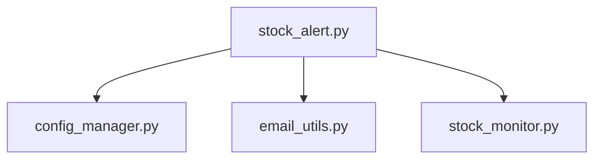

# Stock Alert Service

This service checks multiple stock prices at regular intervals using real-time data from Tradegate Exchange and sends an email alert when a price threshold is reached.

## Configuration

Set the following environment variables in an `.env` file (see `.env.example`) or pass them directly in the `docker run` command with `--env key=value`:

- `EMAIL_TO`: Recipient email address
- `EMAIL_FROM`: Sender email address
- `SMTP_SERVER`: SMTP server address (your ISP's server)
- `SMTP_PORT`: SMTP server port (default: 587)
- `SMTP_USERNAME`: SMTP login username
- `SMTP_PASSWORD`: SMTP login password
- `CONFIG_PATH`: Path to the JSON config file which lists all stock ISINs to be monitored (default: `config.json`)
- `MAX_FAIL_COUNT`: Maximum allowed consecutive failures to retrieve a stock price before stopping the service (default: 3)
- `CHECK_INTERVAL`: Check interval in seconds (default: 60)
- `MARKET_OPEN`: Market open time in HH:MM (24h) format (default: 07:30)
- `MARKET_CLOSE`: Market close time in HH:MM (24h) format (default: 22:00)
- `MAX_EXCEPTIONS`: Max consecutive unexpected exceptions before service terminates (default: 10)

Create a `config.json` file in the same directory with a list of ISIN/threshold pairs:

```json
[
  {"isin": "US69608A1088", "upper_threshold": 129.87, "lower_threshold": 112.21},
  {"isin": "US4581401001", "upper_threshold": 17.87, "lower_threshold": 17.65}
]
```

- `upper_threshold` (optional): Alert if price is greater than or equal to this value.
- `lower_threshold` (optional): Alert if price is less than or equal this value.

## How it works

- The script scrapes the real-time price from the Tradegate order book page for each ISIN in the config file.
- If the stock price meets or exceeds the upper threshold, or meets or falls below the lower threshold, you receive an email alert for that stock and further alerts will be deactivated for that stock (until re-enabled via the admin UI or config).

## Build and Run with Docker

```bash
docker build -t stock-alert .

docker run --env-file .env -p 5000:5000 stock-alert
```

## Notes

- No API key is required; the script uses web scraping for real-time prices.
- Web scraping may break if Tradegate changes their website layout.
- The service uses an external SMTP server for sending emails. Configure your SMTP server details in the `.env` file.

## Module Dependency Graph


